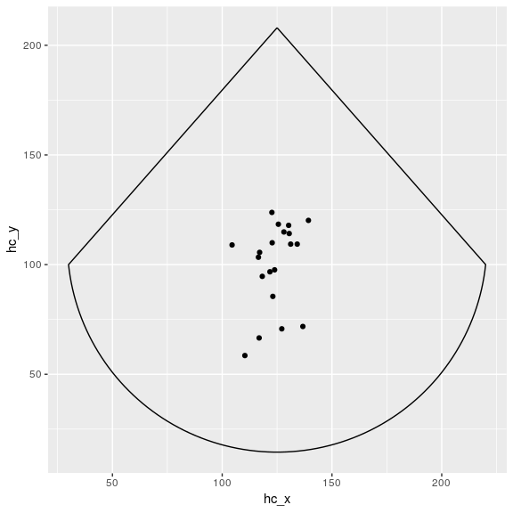
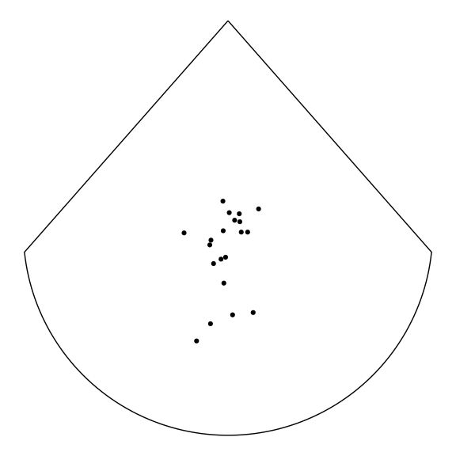
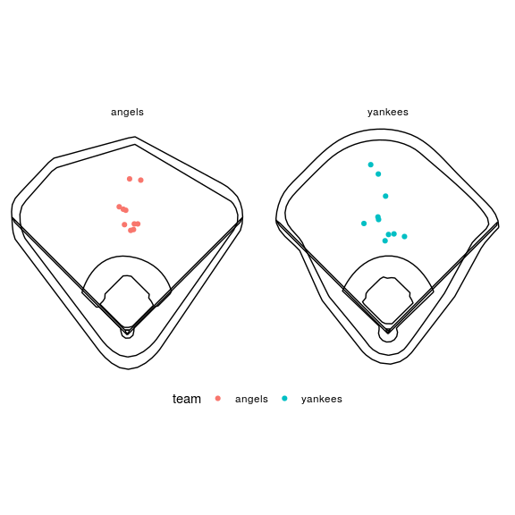

<!-- README.md is generated from README.Rmd. Please edit that file -->
GeomMLBStadiums
===============

This package defines a couple of Geoms to draw MLB stadiums in ggplot2. It also provides a Geom to draw a "spraychart" - `x` and `y` locations of batted balls with a stadium overlay.

Example use
-----------

### Install from github and load the necessary libraries

``` r
devtools::install_github("bdilday/GeomMLBStadiums")
library(GeomMLBStadiums)
library(ggplot2)
library(dplyr)
```

### The stadium data

When you load the `GeomMLBStadiums` package it will attach the stadium paths as a data frame, `MLBStadiumsPathData`

``` r
head(MLBStadiumsPathData)
#> # A tibble: 6 x 4
#>   team       x     y segment      
#>   <chr>  <dbl> <dbl> <chr>        
#> 1 angels  148.  179. infield_inner
#> 2 angels  145.  182. infield_inner
#> 3 angels  142.  184. infield_inner
#> 4 angels  140.  187. infield_inner
#> 5 angels  137.  189. infield_inner
#> 6 angels  135.  192. infield_inner
```

The data comprise the 30 current MLB stadiums, in addition to a "generic" stadium. The stadia are identified by team name, with the following conventions

``` r
unique(MLBStadiumsPathData$team)
#>  [1] "angels"       "astros"       "athletics"    "blue_jays"   
#>  [5] "braves"       "brewers"      "cardinals"    "cubs"        
#>  [9] "diamondbacks" "dodgers"      "giants"       "indians"     
#> [13] "mariners"     "marlins"      "mets"         "nationals"   
#> [17] "orioles"      "padres"       "phillies"     "pirates"     
#> [21] "rangers"      "rays"         "red_sox"      "reds"        
#> [25] "rockies"      "royals"       "tigers"       "twins"       
#> [29] "white_sox"    "yankees"      "generic"
```

The segments are split up into `outfield_outer`, `outfield_inner`, `infield_inner`, `infield_outer`, `foul_lines`, and `home_plate`

``` r
unique(MLBStadiumsPathData$segment)
#> [1] "infield_inner"  "infield_outer"  "outfield_outer" "outfield_inner"
#> [5] "foul_lines"     "home_plate"
```

### Coordinates

The stadium paths are in the system of the `hc_x` and `hc_y` coordinates of MLBAM. These are inverted (because they're based on a display device where `y=0` is at top, IIRC) which means by default the field gets displayed upside down. This package provides a helper function, `mlbam_xy_transformation`, that transforms these values to a system where y increases from bottom to top and home plate is located at `(0, 0)`.

``` r
set.seed(101)
batted_ball_data = data.frame(hc_x = rnorm(20, 125, 10), 
                              hc_y = rnorm(20, 100, 20))

head(batted_ball_data)
#>       hc_x      hc_y
#> 1 121.7396  96.72489
#> 2 130.5246 114.17044
#> 3 118.2506  94.64039
#> 4 127.1436  70.72156
#> 5 128.1077 114.88872
#> 6 136.7397  71.79220

head(mlbam_xy_transformation(batted_ball_data))
#>       hc_x      hc_y      hc_x_    hc_y_
#> 1 121.7396  96.72489  -8.136798 255.2450
#> 2 130.5246 114.17044  13.787630 211.7067
#> 3 118.2506  94.64039 -16.844378 260.4473
#> 4 127.1436  70.72156   5.349707 320.1408
#> 5 128.1077 114.88872   7.755777 209.9141
#> 6 136.7397  71.79220  29.298336 317.4688

summary(mlbam_xy_transformation(batted_ball_data))
#>       hc_x            hc_y            hc_x_             hc_y_      
#>  Min.   :104.5   Min.   : 58.54   Min.   :-51.169   Min.   :187.7  
#>  1st Qu.:118.0   1st Qu.: 92.36   1st Qu.:-17.592   1st Qu.:211.3  
#>  Median :123.5   Median :107.28   Median : -3.819   Median :228.9  
#>  Mean   :124.0   Mean   : 99.90   Mean   : -2.429   Mean   :247.3  
#>  3rd Qu.:130.3   3rd Qu.:114.35   3rd Qu.: 13.301   3rd Qu.:266.1  
#>  Max.   :139.3   Max.   :123.80   Max.   : 35.632   Max.   :350.5
```

### `geom_mlb_stadium`

This uses `geom_mlb_stadium`, which implicitly loads the `MLBStadiumsPathData` data, to plot the 30 current stadiums.

``` r
ggplot() + 
  geom_mlb_stadium(stadium_ids = "all_mlb", 
                   stadium_segments = "all") + 
  facet_wrap(~team) + 
  coord_fixed() + 
  theme_void()
```


An alternative way is to explicitly pass the data to `geom_path`.

``` r
MLBStadiumsPathData %>% 
  filter(team != 'generic') %>% 
  mutate(g=paste(team, segment, sep="_")) %>% 
  ggplot(aes(x, y)) + 
  geom_path(aes(group=g)) + 
  facet_wrap(~team) + 
  coord_fixed() + 
  theme_void()
```


This shows the generic stadium, which is the default,

``` r
ggplot() + 
  geom_mlb_stadium(stadium_segments = "all") + 
  facet_wrap(~team) + 
  coord_fixed() + 
  theme_void()
```


### `geom_spraychart`

This generates some simulated data.

``` r
# first generate the data
set.seed(101)
batted_ball_data = data.frame(hc_x = rnorm(20, 125, 10),
                              hc_y = rnorm(20, 100, 20))
batted_ball_data$team = rep(c("angels", "yankees"), each=10)
```

This plots the data as a spraychart. By default it uses the "generic" stadium.

``` r
batted_ball_data %>% 
  ggplot(aes(x=hc_x, y=hc_y)) + 
  geom_spraychart() 
```



Add some styling using `theme_void` and `coord_fixed`

``` r
batted_ball_data %>% 
  ggplot(aes(x=hc_x, y=hc_y)) + 
  geom_spraychart() + 
  theme_void() + 
  coord_fixed()
```



This transforms the data and the stadium before plotting, passes the team names in `stadium_ids`, draws all segments, and facets by field.

``` r
batted_ball_data %>% mlbam_xy_transformation() %>%  
    ggplot(aes(x=hc_x_, y=hc_y_, color=team)) + 
    geom_spraychart(stadium_ids = unique(batted_ball_data$team),
                    stadium_transform_coords = TRUE, 
                    stadium_segments = "all") + 
    theme_void() + 
    coord_fixed() + 
    facet_wrap(~team) + 
    theme(legend.position = "bottom")
```



You can make use of any of the other `ggplot2` functions, for example, contours from `stat_density2d`. The `mapping` argument for `geom_spraychart` gets passed to the underlying `geom_point`, as do any extra parameters passed into the `...` argument of `geom_spraychart`, e.g. `size=5` in the below.

``` r
batted_ball_data %>% mlbam_xy_transformation() %>%  
  ggplot(aes(x=hc_x_, y=hc_y_, color=team)) + 
  geom_spraychart(mapping = aes(shape=team), 
                  stadium_ids = unique(batted_ball_data$team),
                  stadium_transform_coords = TRUE, 
                  stadium_segments = "all", size=5) + 
  theme_void() + 
  coord_fixed() + 
  facet_wrap(~team) + 
  theme(legend.position = "bottom") + 
  stat_density2d(color='gray')
```


